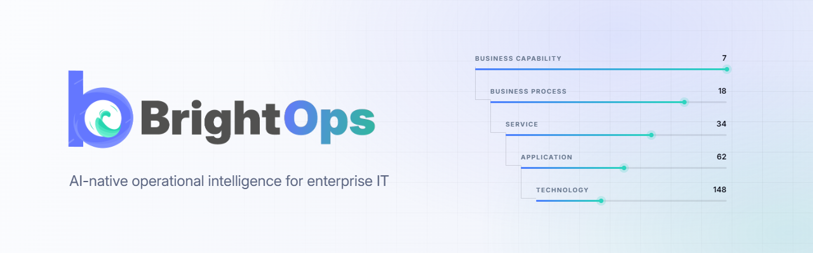
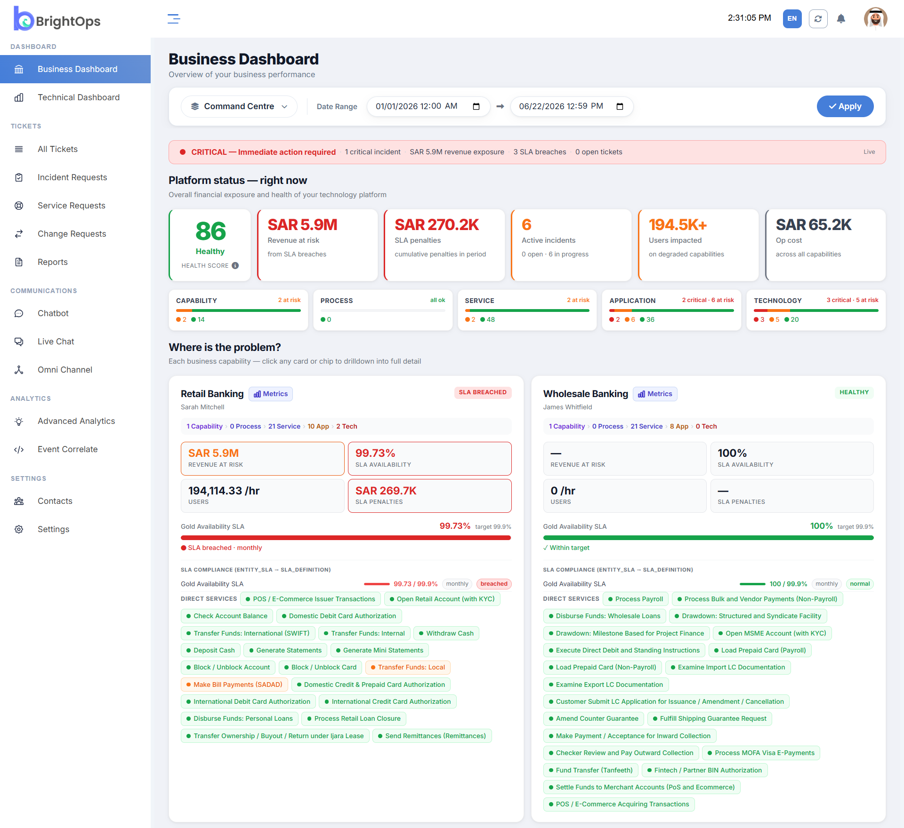
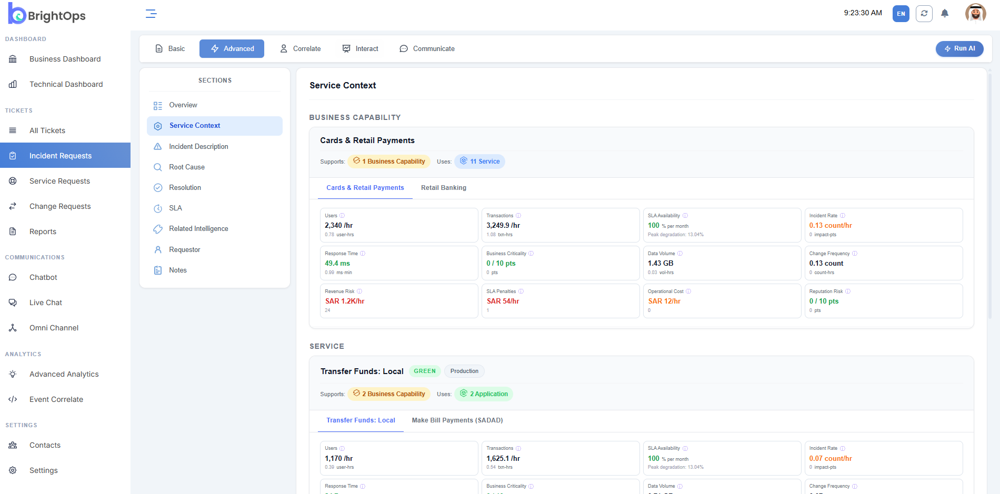
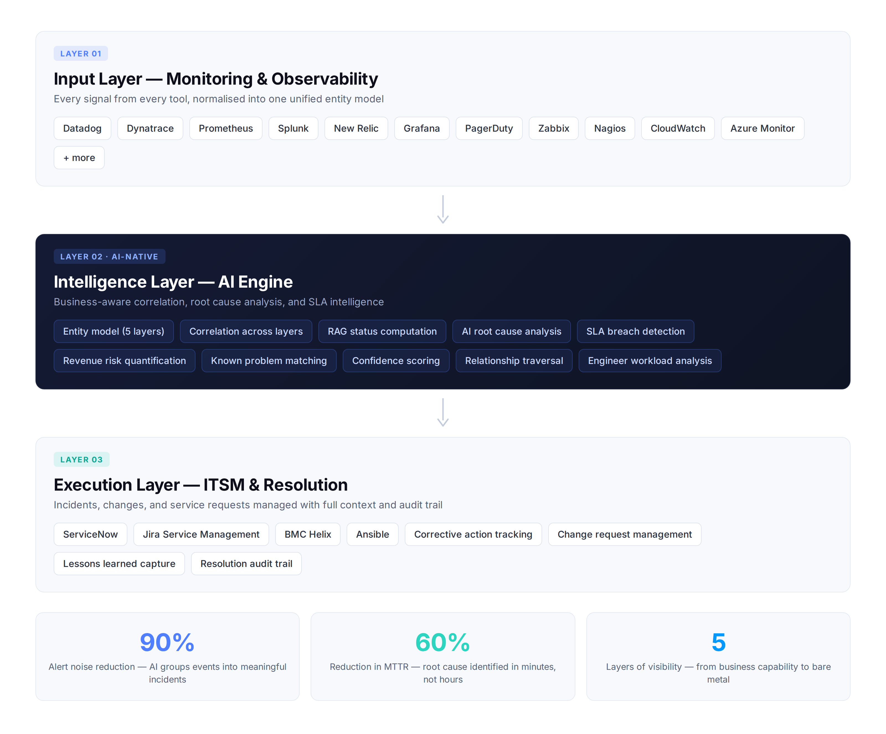

  <picture>
    <source media="(prefers-color-scheme: dark)" srcset="docs/assets/banner-dark.png">
    <source media="(prefers-color-scheme: light)" srcset="docs/assets/banner-light.png">
    
  </picture>

  <strong>AI-native operational intelligence for enterprise IT</strong> 
  business-aware monitoring, AI root cause analysis, SLA intelligence, and unified IT operations.

  

## Is this for you?

BrightOps is built for enterprise IT teams where infrastructure problems
have measurable business consequences.

**A good fit if:**

- [x] You run IT for an organisation where downtime carries revenue or SLA cost
- [x] Your team is drowning in alerts and correlating them by hand
- [x] You already run monitoring tools — Datadog, Dynatrace, Prometheus, Splunk,
      New Relic, Grafana — and need them unified rather than replaced
- [x] You use ServiceNow, Jira Service Management, or BMC Helix for ITSM
- [x] Leadership asks "what is this costing us?" and you have no fast answer
- [x] You need SLA breach and penalty exposure visible before it escalates
- [x] You need SSO, RBAC, and audit logs to pass security review

**Not a fit if:**

- [ ] You have no dedicated IT team → see **BrightOps Lite**, an AI IT
      department for businesses without one
- [ ] You want a monitoring tool — BrightOps augments your existing stack,
      it does not replace it
- [ ] You are looking for migration or disaster recovery tooling

## Without BrightOps vs. with BrightOps

| Without BrightOps | With BrightOps |
|---|---|
| ❌ Hundreds of raw alerts per day, correlated by hand | ✅ 90% alert noise reduction — events grouped into meaningful incidents |
| ❌ Root cause traced manually across tools, taking hours | ✅ 60% reduction in MTTR — root cause identified in minutes |
| ❌ "Is it fixed yet?" answered with a status guess | ✅ Revenue at risk quantified in real time, per capability |
| ❌ SLA breaches discovered after the penalty lands | ✅ Every breach, entity, and penalty quantified as it happens |
| ❌ Monitoring, tickets, and spreadsheets in separate places | ✅ One platform replacing fragmented dashboards and tools |
| ❌ A database alert is just a database alert | ✅ A database alert is a $2.4M risk on Payment Processing |

## Features

| | |
|---|---|
| **Business-aware monitoring** | Every metric — SLA availability, response time, incident rate, revenue risk — tracked at every layer. Not just infrastructure health, but business health. |
| **AI root cause analysis** | Traces failures through the dependency chain to identify the exact cause with confidence scoring — not just alerts. |
| **Integrated incident & change management** | Incidents, change requests, and service requests in one place, with SLA timers, corrective actions, root cause, and lessons learned. |
| **Dual SLA compliance** | Tracks both support SLAs (response, restoration, resolution) and service SLAs (availability per entity), with breach detection and penalty quantification. |
| **Engineer & on-call management** | Assigned and on-call workload per engineer in real time — who owns what, what's at risk, where capacity is concentrated. |
| **Technology attribute intelligence** | Attributes per technology node — CPU, memory, disk latency, queue depth, error rate, availability, restart frequency — with degradation scoring. |

Built on a **five-layer entity model** — Business Capability → Business Process → Service → Application → Technology — so every technical signal maps to the business function it supports.

  

  <em>Incident view — business capability, service, and application context in one place</em>

## How it works

  <picture>
    <source media="(prefers-color-scheme: dark)" srcset="docs/assets/architecture-dark.png">
    <source media="(prefers-color-scheme: light)" srcset="docs/assets/architecture-light.png">
    
  </picture>

**1. Detect — every signal, every layer**
CPU, disk queue depth, error rate, response time — ingested from your existing monitoring tools into a unified entity model.

**2. Understand — AI correlates the cause**
Events are grouped and traced through the dependency chain to the root cause, not the symptom. A missing index on `user_transactions` causing connection pool exhaustion reads as exactly that.

**3. Decide — structured response**
Corrective actions and change requests created, engineer assigned, SLA timers running.

**4. Act — close the loop**
Resolution outcome recorded, lessons learned captured, known problems linked. Everything auditable.

---

### Three layers underneath

| Layer | What it does |
|---|---|
| **Input** — Monitoring & Observability | Normalises signals from Datadog, Dynatrace, Prometheus, Splunk, New Relic, Grafana, PagerDuty, Zabbix, Nagios, CloudWatch, Azure Monitor, and 140+ more |
| **Intelligence** — AI Engine | Entity modelling, correlation, RAG status, root cause analysis, SLA breach detection, revenue risk quantification, confidence scoring |
| **Execution** — ITSM & Resolution | ServiceNow, Jira Service Management, BMC Helix, Ansible — with corrective action tracking and full audit trail |

## What BrightOps is not

| Not this | Why |
|---|---|
| **Not a replacement for your monitoring tools** | BrightOps ingests from Datadog, Dynatrace, Prometheus, Splunk and the rest. It augments your stack rather than replacing it. |
| **Not another dashboard to watch** | The point is fewer things to watch, not one more. Alerts are correlated into incidents with a cause attached. |
| **Not a migration or disaster recovery tool** | BrightOps does not move workloads or perform backup, failover, or restore. |
| **Not the right fit without an IT team** | Enterprise operates alongside your engineers. If you have no IT staff, [**BrightOps Lite**](https://brightaira.com/en/editions) is the AI IT department built for that. |

## Integrations

**Monitoring & observability** — Datadog · Dynatrace · Prometheus · Splunk · New Relic · Grafana · PagerDuty · Zabbix · Nagios · CloudWatch · Azure Monitor

**ITSM & execution** — ServiceNow · Jira Service Management · BMC Helix · Ansible

## See it with your data

We run a live technical session mapped to your environment and stack — your capabilities, your monitoring tools, your SLAs.

**[Request a demo →](https://brightaira.com/en/contact)**

## FAQ

<strong>Does BrightOps replace our monitoring tools?</strong>

No. BrightOps ingests from your existing tools — Datadog, Dynatrace, Prometheus, Splunk and others — and normalises every signal into one entity model. You keep what you have.

<strong>How is this different from BrightOps Lite?</strong>

Enterprise operates alongside an existing IT team, handling detection, correlation, and business impact quantification while your engineers focus on decisions that need judgment. Lite is a full AI IT department for businesses with no dedicated IT staff. [Compare editions →](https://brightaira.com/en/editions)

<strong>What does "business-aware" actually mean?</strong>

Every technical entity maps through a five-layer model — Business Capability → Business Process → Service → Application → Technology. A failing database isn't just an alert; it's a quantified revenue risk on the capability it supports.

<strong>How does root cause analysis work?</strong>

The AI engine traverses entity relationships to trace a symptom back to its origin, with confidence scoring on the result — identifying the specific failure rather than the surface alert.

<strong>Which ITSM systems does it integrate with?</strong>

ServiceNow, Jira Service Management, and BMC Helix, with incidents, change requests, and service requests managed with full context and audit trail.

<strong>How long does deployment take?</strong>

⟨needs engineering input⟩

## Documentation

Full product documentation and setup guides are being published here.

## Contact

[brightaira.com](https://brightaira.com)
